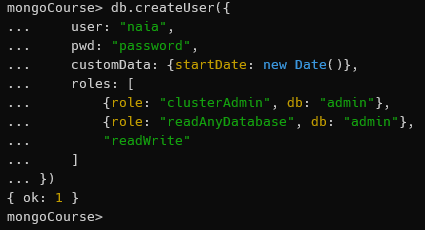
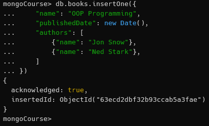
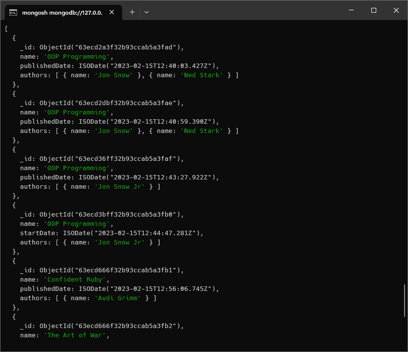

# MongoDB

<div id="indice"></div>

* [Instalar MongoDB](#instalar-mongodb)
* [Introducción a MongoDB](#introducción-a-mongodb)
* **Crear**
    * [Crear un usuario](#crear-un-usuario)
    * [Crear una colección](#crear-una-colección)
* **Añadir**
    * [Añadir documentos a una colección](#añadir-documentos-a-una-colección)
    * [Añadir varios documentos a una colección](#añadir-varios-documentos-a-una-colección)
* **Consultar**
    * [Consultar todos los documentos de una colección](#consultar-documentos)
    * [Consultar documentos específicos](#consultar-documentos-específicos)


<br><hr>
<hr><br>


## Instalar MongoDB

<sub>[Volver al índice](#indice) | [Introducción >>](#introducción-a-mongodb)</sub>

Se puede acceder a la página de descargas de MongoDB desde [este link](https://www.mongodb.com/docs/manual/tutorial/install-mongodb-on-windows/). En ella aparecen los pasos a seguir para instalar MongoDB en Linux, macOS y Windows.

<br>

Además de instalar MongoDB, también se debe instalar la terminal de MongoDB, `mongosh`. Para ello, se deben seguir las instrucciones de [este enlace](https://www.mongodb.com/docs/mongodb-shell/install/).

* En Windows, si la forma de instalar la terminal es a través de un archivo `.zip`, hay que añadir la ruta de instalación de `mongosh` a la variable de entorno `PATH` para poder ejecutarlo desde cualquier directorio.

> Para ello, accedemos a `panel de control > sistema y seguridad > sistema > configuración avanzada del sistema > variables de entorno > variables de entorno` y añadimos la ruta de la carpeta `bin` de `mongosh` a la variable `PATH`.


<br><hr>
<hr><br>


## Introducción a MongoDB

<sub>[<< Instalar MongoDB](#instalar-mongodb) | [Volver al índice](#indice) | [Crear usuario >>](#crear-un-usuario)</sub>

Lo primero que debemos hacer es **acceder a la terminal** de MongoDB, `mongosh`. Para ello, abrimos una terminal y ejecutamos el comando `mongosh`.

Veremos que se nos ha conectado a la base de datos `test` por defecto.

<br>

Para **ver todas las bases de datos** que tenemos, ejecutamos el comando:

```mongo
show dbs
```

<br>

Para crear una **nueva base de datos**, ejecutamos el comando `use <nombre de la base de datos>`. Por ejemplo, para crear una base de datos llamada `mongoCourse`, ejecutamos el comando `use mongoCourse`.

Si volvemos a escribir el comando `show dbs`, veremos que no se ha añadido la base de datos `mongoCourse` a la lista anterior.

```mongo
use mongoCourse
# switched to db mongoCourse

show dbs
```

<br>

Esto se debe a que el simple hecho de crear una base de datos llamada `mongoCourse` (*en este caso*), no hace que se añada a la lista. Para que se añada, debemos comenzar a añadir elementos a la base de datos.

<br>

**Tras haber escrito `use mongoCourse`** veremos que ya no aparece `test` cada vez que escribimos un comando, sino que aparece `mongoCourse`. Esto se debe a que, al crear una base de datos, se nos conecta a ella automáticamente. Además, se nos indica mediante el mensaje `switched to db mongoCourse`.

Si escribimos `db`, veremos que nos devuelve `mongoCourse`. Ese `db` es el objeto que se crea y a través del cual podemos interactuar con la base de datosm, porque hace referencia siempre a la base de datos con la que se está trabajando.


<br><hr>
<hr><br>


## Crear un usuario

<sub>[<< Usar MongoDB](#usar-mongodb) | [Volver al índice](#indice) | [Crear colección >>](#crear-una-colección)</sub>

Escribir en Mongo es bastante similar a escribir código JavaScript. Por ello, se tiende a alternan bastante entre escribir código en la terminal de `mongosh` y escribir en un editor de texto como puede ser *Visual Studio Code*.

<br>

Ahora, vamos a crear un usuario para nuestra base de datos (para almacenarlo en ella). Para ello, crearemos un archivo al que (en mi caso) llamaré `createUser.js` y escribiremos el siguiente código:

```js
db.createUser({
    user: "naia",
    pwd: "password",
    customData: {startDate: new Date()},
    roles: [
        {role: "clusterAdmin", db: "admin"},
        {role: "readAnyDatabase", db: "admin"},
        "readWrite"
    ]
})
```

<br>

Las claves de este objeto son claves concretas de MongoDB.

Una vez creado el código, lo copiamos, volvemos a la `mongo shell` y lo pegamos. Si todo ha ido bien, veremos que se nos ha creado el usuario.



<br>

Para crear más usuarios, simplemente volveríamos a escribir el código anterior, pero cambiando los valores de las claves `user` y `pwd`:

> Al ser un ejemplo, sólo he modificado el nombre de usuario.

```js
db.createUser({
    user: "cris",
    pwd: "password",
    customData: {startDate: new Date()},
    roles: [
        {role: "clusterAdmin", db: "admin"},
        {role: "readAnyDatabase", db: "admin"},
        "readWrite"
    ]
})
```

<br>

Para **ver todos los usuarios** que tenemos en la base de datos, ejecutamos el comando `db.getUsers()`:

```mongo
db.getUsers()
```

<br>

Esta sería la respuesta del comando:


<br>

Como se puede observar, nos devuelve ambos usuarios.

Podemos eliminar un usuario escribiendo el siguiente comando directamente en la terminal:

```mongo
db.dropUser("cris")
```

<br>

Si volvemos a ejecutar el comando `db.getUsers()`, veremos que ya no aparece el usuario `cris`:


<br><hr><br>


## Crear una colección

<sub>[<< Crear usuario](#crear-un-usuario) | [Volver al índice](#indice) | [Añadir documentos >>](#añadir-documentos-a-una-colección)</sub>

Al escuchar las palabras `base de datos` podríamos pensar en una especie de tabla con información. En el caso de MongoDB, una base de datos es un conjunto de colecciones en vez de una tabla.

En esas colecciones, se almacenan los documentos, pero antes de comenzar a guardar documentos, debemos crear una colección.

<br>

A lo largo de este curso, vamos a crear una base de datos para almacenar libros, por ello, lo primero que debemos hacer ahora es crear una colección a la que llamaremos `books`.

Para realizar esto, vamos a ir a la terminal de `mongosh` y escribiremos el siguiente comando:

```mongo
db.createCollection("books")
```

<br>

Tras hacer esto, la terminal devolverá un `{ ok: 1 }`, lo que significa que se ha creado la colección correctamente.

<br>

Para **ver todas las colecciones** que tenemos en la base de datos, ejecutamos el comando:

```mongo
show collections
```

<br>

Y veremos que se nos ha creado la colección `books`.


<br><hr>
<hr><br>


## Añadir documentos a una colección

<sub>[<< Crear colección](#crear-una-colección) | [Volver al índice](#indice) | [Añadir varios a la vez >>](#añadir-varios-documentos-a-una-colección)</sub>

Vamos a añadir libros a nuestra base de datos:

```mongo
db.books.insertOne({
    "name": "OOP Programming",
    "publishedDate": new Date(),
    "authors": [
        {"name": "Jon Snow"},
        {"name": "Ned Stark"},
    ]
})
```

<br>

Si copiamos el código y lo pegamos en la `mongosh`, veremos que se nos ha añaadido el documento correctamente:



<br>

Podemos modificar el código anterior y escribir el siguiente para añadir otro libro:

```mongo
db.books.insertOne({
    "name": "OOP Programming",
    "publishedDate": new Date(),
    "authors": [
        {"name": "Jon Snow Jr"},
    ]
})
```

<br>

Vamos incluso a añadir un tercer libro:

```mongo
db.books.insertOne({
    "name": "OOP Programming",
    "startDate": new Date(),
    "authors": [
        {"name": "Jon Snow Jr"},
    ]
})
```

<br>

Hay datos iguales y otros diferentes en los documentos. Es importante conocer que **MongoDB no sigue ningún esquema**, se pueden añadir documentos con diferentes campos y no se van a ver afectados los demás documentos, ni se nos devolverá ningún error.

Esto puede ser útil y problemático al mismo tiempo, por lo que es importante conocerlo.


<br><hr><br>


## Añadir varios documentos a una colección

<sub>[<< Añadir documentos](#añadir-documentos-a-una-colección) | [Volver al índice](#indice)</sub>

Hemos visto cómo insertar documentos en una colección, pero podríamos querer añadir varios documentos a la vez.

Para ello, realizaremos lo siguiente:

```mongo
db.books.insertMany([
    {
        "name": "Confident Ruby",
        "publishedDate": new Date(),
        "authors": [
            {"name": "Avdi Grimm"}
        ]
    },
    {
        "name": "The Art of War",
        "publishedDate": new Date(),
        "authors": [
            {"name": "Steven Pressfield"}
        ]
    },
    {
        "name": "Blink",
        "publishedDate": new Date(),
        "authors": [
            {"name": "Malcom Gladwell"}
        ]
    }
])
```

<br>

En este caso, al haber insertado varios documentos a la vez y haberse creado más de uno, la respuesta que nos devuelve la terminal es:


<br>

Donde tenemos una *respuesta* por cada documento que hemos insertado.


<br><hr>
<hr><br>


## Consultar documentos

<sub>[<< Añadir varios documentos >>](#añadir-varios-documentos-a-una-colección) | [Volver al índice](#indice) | [Consultar específicos >>](#consultar-documentos-específicos)</sub>

Para consultar documentos, vamos a utilizar el comando `find()`.

Vamos a continuar con el ejemplo de los libros, por lo que vamos a escribir el siguiente comando:

```mongo
db.books.find()
```

<br>

Se nos devolverán todos los documentos que tenemos en la colección `books`:



<br>

Este es el equivalente a `SELECT * FROM books;` en SQL.

También podemos ver que MongoDB ha añadido un campo `_id` a cada documento, que es el identificador único de cada documento.


<br><hr><br>


## Consultar documentos específicos

<sub>[<< Consultar documentos](#consultar-documentos) | [Volver al índice](#indice)</sub>

Hay ocasiones en las que no queremos consultar todos los documentos de una colección, sino que queremos consultar documentos específicos.

Para ello:

```mongo
db.books.find({name: "The Art of War"})
```

<br>

Si ejecutamos el comando anterior, veremos que nos devuelve el documento que tiene el nombre `The Art of War`:


<br>

Si consultamos un dato y hay más de un documento con ese dato, se nos devolverán todos los documentos que tengan ese dato.

<br>

En SQL esto sería equivalente a:

```sql
SELECT * FROM books
WHERE name = "The Art of War";
```

