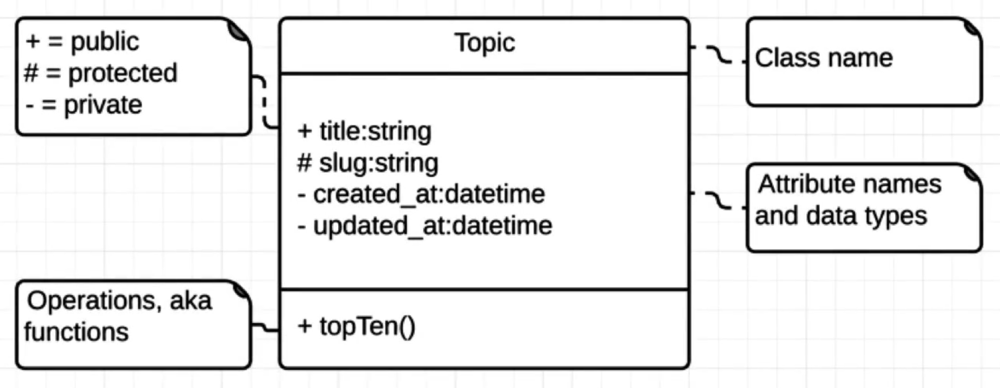

# COMPONENTES Y ELEMENTOS COMUNES

* [Frames](#frames)
* [Classifiers](#classifiers)
* [Comments](#comments)
* [Dependencies](#dependencies)
* [Features or Properties](#features-or-properties)

 

[<< INTRODUCCIÓN](./00_intro.md#introducción-a-uml)

 

 

## Frames

[Volver al índice](#indice) | [Classifiers >>](#classifiers)

### Qué es un Frame

Los `frames` son elementos que ayudan a encapsular los `view components`, principalmente, se encargan de ofrecer el contexto de los elementos que se encuentran dentro de ellos.

 

### Cómo se representa

Para representar los `frames` se utilizan `headings`, donde hay una notación descriptiva sobre cuál es el modelo.

 

### Por qué se usa

Se usa para entender de froma rápida y sencilla el modelo que se está representando.

 
 

### Diagram mapping

* **act** = activity diagram
* **class** = class diagram
* **cmp** = component diagram
* **dep** = deployment diagram
* **sd** = interaction (*sequence*) diagram
* **pkg** = package diagram
* **stm** = state machine diagram
* **uc** = use case diagram

 

Ejemplo de un diagrama de `use case` con un `frame`:

 

Sabemos que se trata de ese tipo de diagrama debido a la notación que se encuentra en la esquina superior izquierda de la imagen, donde además, hay un pequeño `heading` descriptivo.

 

 

## Classifiers

[<< Frames](#frames) | [Volver al índice](#indice) | [Stereotypes >>](#stereotypes)

### Qué es un Classifier

Nos permiten identificar los componentes. Son bastante abstractos, donde se clasifican los componentes.

 
 

### Usado por

Son usados por prácticamente todos los elementos de UML:

* **Class**
* **Interface**
* **Association**
* **Data Type**
* **Actor**
* **Use Case**
* **Artifact**
* **Component**
* **Signal**

 

Ejemplo de un diagrama de `use case` con un `classifier`:

 

En este caso, el `Topic` es el nombre del `classifier`, que es de una clase.

 

 

## Comments

[<< Stereotypes](#stereotypes) | [Volver al índice](#indice) | [Dependencies >>](#dependencies)

También conocidos como `notes`, son elementos que nos permiten agregar información adicional a los diagramas. Se pueden agregar en cualquier parte del diagrama, y se pueden agregar varios.

 

### Cómo se representa

Se representan con un rectángulo con una línea punteada.

 

### Por qué se usa

Se usa para agregar información adicional a los diagramas.

 
 

### Ejemplo de comentarios

Si volvemos a usar la imagen vista en el apartado de [classifiers](#usado-por), veremos que hay varios `comments` que nos permiten agregar información adicional a los diagramas.

Los comentarios, como ya hemos mencionado, son esos rectángulos con una línea punteada, y se pueden agregar varios.

 

 

 

## Dependencies

[<< Comments](#comments) | [Volver al índice](#indice) | [Features or Properties >>](#features-or-properties)

### Qué es una Dependency

Sirven para explicar cómo de necesario es un elemento para otro. Son muy útiles para explicar la relación entre los elementos.

 

### Cómo se representa

Se representan con una línea punteada con una flecha.

 

### Por qué se usa

Se usa para explicar la relación entre los elementos. Ayudan a prevenir errores.

 
 

### Ejemplo de dependencias

En esta imagen se ve que hay una dependencia llamada `SongRequest` y que necesita de `SpotifyAPI` para funcionar.

Si se elimina `SpotifyAPI`, `SongRequest` dejará de funcionar.

 

 

 

## Features or Properties

[<< Dependencies](#dependencies) | [Volver al índice](#indice)

### Qué es una Feature o Property

Son elementos que nos permiten agregar información adicional a los elementos.

Ayudan a describir los elementos. Siguen una sintaxis específica (*naming convention*).

 

 

 

[<< INTRODUCCIÓN](./00_intro.md#introducción-a-uml)

