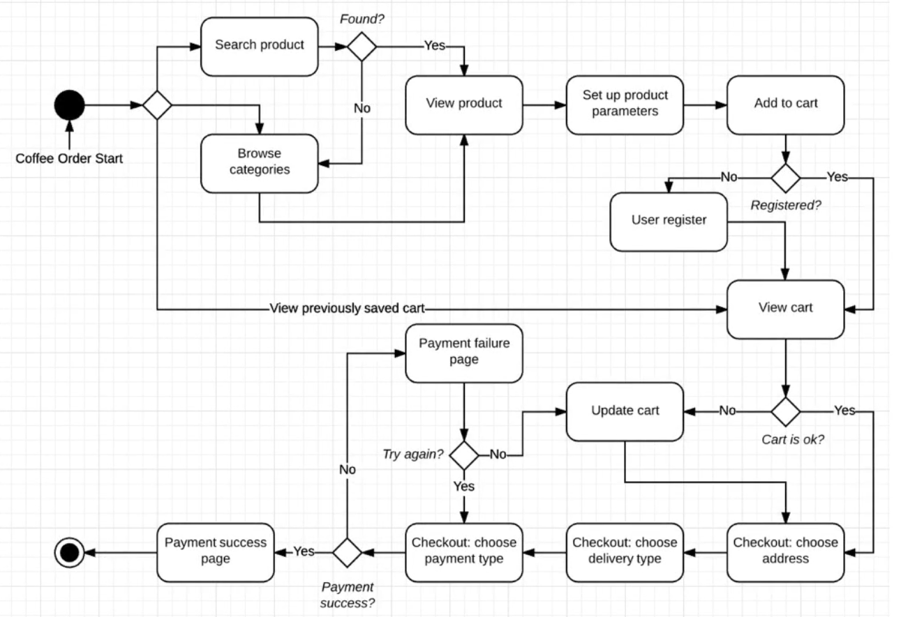
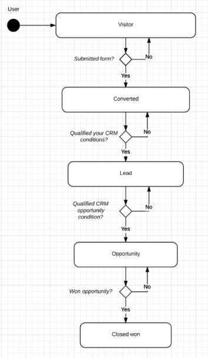
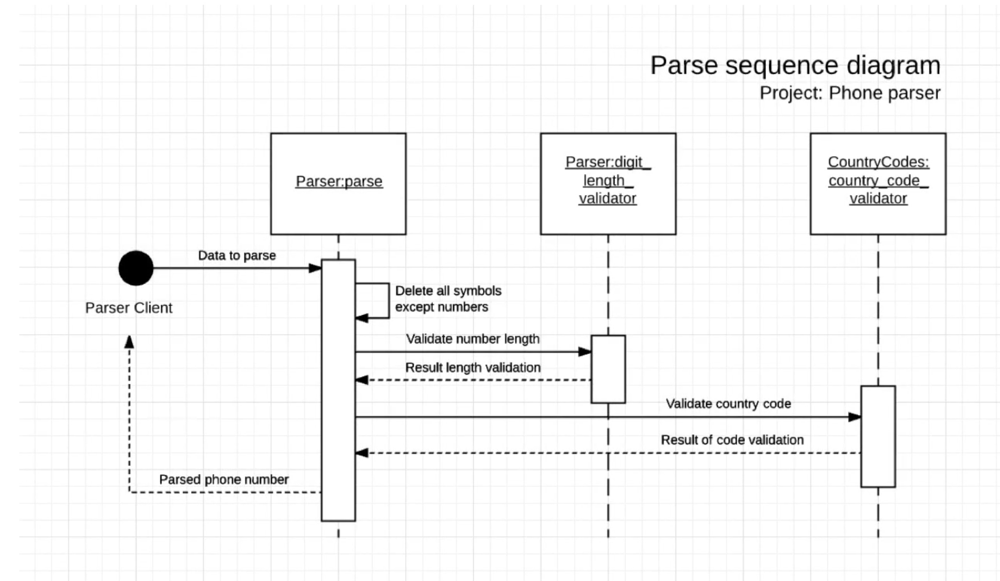

# Behavioral Diagrams

Este tipo de diagramas muestran cómo se comportan los objetos de un sistema, y cómo se comunican entre ellos.

Los diagramas que se van a ver aquí son:

* [Activity Diagrams](#activity-diagrams)
* [Use Case Diagrams](#use-case-diagrams)
* [State Machine Diagrams](#state-machine-diagrams)
* [Sequence Diagrams](#sequence-diagrams)

 

[<< STRUCTURAL DIAGRAMS](./02_structuralDiagrams.md#structural-diagrams)

 

 

## Activity Diagrams

Los elementos que forman parte de este tipo de diagramas son:

* Initial State (*Estado Inicial*)
* Activity or Action State (*Estado de Actividad*)
* Action Flow (*Flujo de Acción*)
* Decisions and Branching (*Estado de Decisión*)
* Guards (*Condiciones*)
* Final State (*Estado Final*)

 

Son diagramas muy simples para usuarios no-técnicos, y muy útiles para los desarrolladores.

Se pueden usar como boceto inicial para tener una idea de cómo continuar con el desarrollo de un sistema.

 

Todo lo que importa aquí es el flujo de acciones, y no el nombre de las funciones, por ejemplo. Se explica **qué pasa cuándo**.

 

 

## Use Case Diagrams

Este tipo de diagramas te permite mostrar todo aquello a lo que un usuario tiene acceso. Por ello, son muy útiles en aquellos casos en los que se quiera diseñar el sistema de autorización.

Los elementos que forman parte de este tipo de diagramas son:

* Use Cases
* Actors
* Subsystems
* Relationships

 

 

 

## State Machine Diagrams

Sirven para mostrar cómo se ven los datos y las acciones de los mismos en diferentes estados a lo largo del ciclo de vida del sistema. Es una forma *antigua* de representar información.

Los elementos que forman parte de este tipo de diagramas son:

* Entry Point
* Choice
* Constraint
* State
* Transition

 

 

 

## Sequence Diagrams

Es uno de esos diagramas que más gustan a los desarrolladores. Esto se debe a que cuanto más desarrollas, más comienzas a pensar en tu sistema como una especie de *enviar y recibir mensajes*, incluso de forma interna.

Este tipo de diagramas es uno de los diagramas más complejos, muestra exactamente cómo debe implementarse el código.

 

Los elementos que forman parte de este tipo de diagramas son:

* Class Roles or Participants
* Activation or Execution Occurrences
* Messages
* Lifelines

 

 

 

[<< STRUCTURAL DIAGRAMS](./02_structuralDiagrams.md#structural-diagrams)