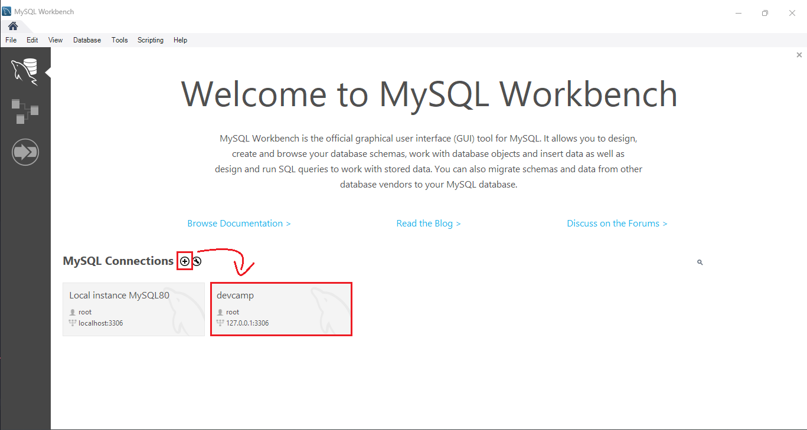
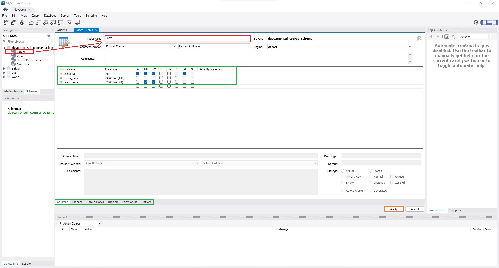
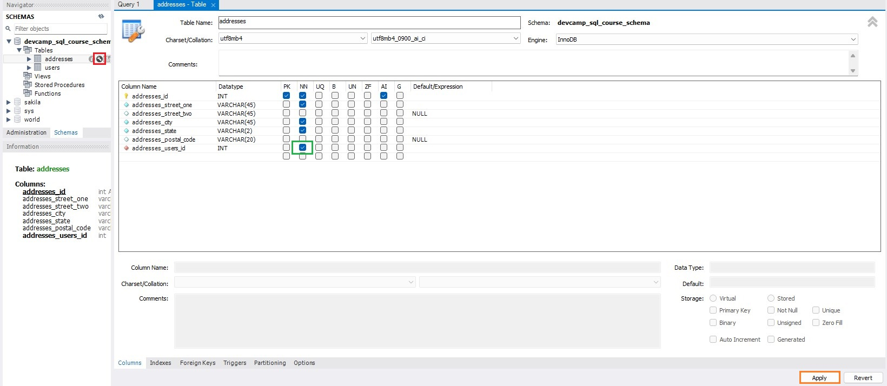

# SQL

<div id="index"></div>

* [Implementaciones](#implementaciones)
* [CRUD](#crud)
* [Descargar e instalar MySQL](#descargar-e-instalar-mysql)
* [Crear un esquema de base de datos](#crear-un-esquema-de-base-de-datos)
* [Crear una tabla](#crear-una-tabla)
* [Crear una tabla con Foreign Key](#crear-una-tabla-con-foreign-key)
* [Modificar columnas](#modificar-columnas)
* [Añadir columnas](#añadir-columnas)

<br/>


[<< BLOG FORM (React)](../module_08-react/09_blog/37_blog_form.md#blog-form) | [HOME](../../README.md#devcamp) | [DATA TYPES >>](./01_data_types.md#sql-data-types)


<br/><hr/>
<hr/><br/>


<div align='right'>
    <a href='#index'>Volver arriba</a>
</div>


SQL es un lenguaje de programación que se utiliza para trabajar con bases de datos relacionales. El acrónimo **SQL** significa *Structured Query Language* (Lenguaje de Consulta Estructurado).

Se llama **bases de datos relacionales** a aquellas que almacenan la información en tablas, y que relacionan unas tablas con otras mediante claves primarias y claves foráneas.

Las aplicaciones modernas, en su inmensa mayoría, utilizan bases de datos para almacenar la información.


<br/><hr/>
<hr/><br/>


<div align='right'>
    <a href='#index'>Volver arriba</a>
</div>

## Implementaciones

Existen muchas implementaciones de SQL, pero las más utilizadas son:

* **MySQL**: una se las más utilizadas. Es *open source* y está siempre en constante desarrollo. *(La que utilizaremos en este curso)*
* **PostgreSQL**: otra de las más utilizadas. Es muy popular en el mundo de la programación *ruby on rails*.
* **Oracle**: es una de las más antiguas, no es *open source* y es de pago. Es muy utilizada en el mundo empresarial.
* **SQL Server**: muy utilizada en el mundo *.NET*. Esta también es de pago.
* **MariaDB**: aplicaciones como *Facebook* utilizan esta implementación. Es *open source*, pero no está tan extendida como otras.

<br/>

A pesar de existir diferentes implementaciones, el lenguaje SQL es el mismo para todas ellas. La diferencia entre unas y otras es mínima y aprender a usar una implementación hará que sea muy sencillo aprender a usar las demás.


<br/><hr/>
<hr/><br/>


<div align='right'>
    <a href='#index'>Volver arriba</a>
</div>

## CRUD

El acrónimo **CRUD** es muy utilizado en el mundo de la programación a la hora de trabajar con bases de datos. Este acrónimo significa:

* **C**reate: crear datos.
* **R**ead: leer datos.
* **U**pdate: actualizar datos.
* **D**elete: eliminar datos.

<br/>

Estas son las operaciones básicas que se pueden realizar sobre una base de datos. En este curso, aprenderemos a realizar todas ellas.


<br/><hr/>
<hr/><br/>


<div align='right'>
    <a href='#index'>Volver arriba</a>
</div>

## Descargar e instalar MySQL

Para poder trabajar con MySQL, lo primero que tenemos que hacer es descargarlo e instalarlo en nuestro ordenador.

Para poder descargar el programa, accederemos a la [página del producto](https://dev.mysql.com/downloads/installer/) y escogeremos la opción de descarga que más se ajuste a nuestro sistema operativo. Después, escogeremos la opción de descarga web (*si estamos conectados a internet*) o la opción de descarga offline (*si no estamos conectados a internet*).

Una vez descargado, clicaremos en él y seguiremos los pasos mostrados [en este vídeo](https://www.youtube.com/watch?v=GIRcpjg-3Eg) o realizaremos la configuración que nos parezca más adecuada.


<br/><hr/>
<hr/><br/>


<div align='right'>
    <a href='#index'>Volver arriba</a>
</div>

## Crear un esquema de base de datos

Ahora que hemos instalado y configurado el *Workbench* de MySQL, vamos a crear un esquema de base de datos.

Para crear un esquema desde aquí, crearemos una conexión clicando el símbolo `+` que aparece en la parte izquierda de la pantalla, o clicando dos veces en alguna conexión que ya tengamos creada (*se nos pedirá la contraseña introducida durante la instalación*).



<br/>

Hecho esto, crearemos un nuevo esquema siguiendo estos pasos:

* **Rojo**: Clicar el botón `Create a new schema in the connected server` que aparece en la parte superior de la pantalla (*tiene una base de datos como icono*). Le pondremos el nombre que queramos (en este caso `devcamp_sql_course_schema`).
* **Verde**: clicar en `Apply` (*abajo a la derecha*). Se nos abrirá una ventana con el código SQL que se ejecutará para crear el esquema. Clicaremos en `Apply` (*abajo a la derecha*) y el esquema se creará.
* **Naranja**: una vez creado el esquema, aparecerá en la parte izquierda de la pantalla, en la sección `SCHEMAS`.

<br/>


<br/>

El código SQL que se ha ejecutado es el siguiente:

```sql
CREATE SCHEMA `devcamp_sql_course_schema`;
```

<br/>

Hemos realizado esta operación utilizando el *Workbench* de MySQL, pero podríamos haber ejecutado el mismo código desde la consola de comandos de MySQL.


<br/><hr/>
<hr/><br/>


<div align='right'>
    <a href='#index'>Volver arriba</a>
</div>

## Crear una tabla

Estos son los pasos a seguir para crear una nueva tabla desde el *Workbench* de MySQL:



* **Rojo**: Para crear una nueva tabla, haremos clic derecho en el esquema que acabamos de crear y seleccionaremos la opción `Create table...`. A continuación, indicaremos el nombre que queremos darle a la tabla (en este caso `users`).
* **Verde**: rellenaremos las filas de la tabla con los datos que queramos. Indicaremos (*marcando los checkbox*) qué condiciones queremos que cumpla cada dato. En la parte inferior podremos abrir diferentes pestañas para ver cómo se han generado los diferentes campos de la tabla. En nuestro caso, hemos creado tres campos:
    * `users_id`: campo de tipo `INT`, clave primaria y autoincremental.
    * `users_name`: campo de tipo `VARCHAR` de 100 caracteres.
    * `users_email`: campo de tipo `VARCHAR` de 80 caracteres, no nulo y único.
* **Naranja**: botón de `Apply`, que ejecutará el código SQL que se ha generado para crear la tabla.

<br/>

Al pulsar el botón, se abre una ventana donde se muestra el código SQL que se va a ejecutar teniendo en cuenta las opeaciones que hemos realizado. Este es el código que se ha generado:

```sql
CREATE TABLE `devcamp_sql_course_schema`.`users` (
    `users_id` INT NOT NULL AUTO_INCREMENT,
    `users_name` VARCHAR(100) NULL,
    `users_email` VARCHAR(80) NOT NULL,
    PRIMARY KEY (`users_id`),
    UNIQUE INDEX `users_id_UNIQUE` (`users_id` ASC) VISIBLE,
    UNIQUE INDEX `users_email_UNIQUE` (`users_email` ASC) VISIBLE);
```


<br/><hr/>
<hr/><br/>


<div align='right'>
    <a href='#index'>Volver arriba</a>
</div>

## Crear una tabla con Foreign Key'

Para crear una tabla con una clave foránea, en primer lugar, necesitaremos tener **al menos 2 tablas**.

Ya hemos creado una tabla en el apartado anterior, por lo que vamos a crear otra tabla a continuación siguiendo los mismos pasos, pero esta vez la llamaremos `addresses` y tendrá los siguientes campos:

* `addresses_id`: campo de tipo `INT`, clave primaria y autoincremental.
* `addresses_street_one`: campo de tipo `VARCHAR` de 45 caracteres y obligatorio.
* `addresses_street_two`: campo de tipo `VARCHAR` de 45 caracteres.
* `addresses_city`: campo de tipo `VARCHAR` de 45 caracteres y obligatorio.
* `addresses_state`: campo de tipo `VARCHAR` de 2 caracteres y obligatorio.
* `addresses_postal_code`: campo de tipo `VARCHAR` de 20 caracteres.
* `addresses_users_id`: campo de tipo `INT` y clave foránea.

<br/>


<br/>

A estas alturas, habremos creado los datos e indicado que uno de ellos es una clave foránea, pero no habremos indicado a qué tabla hace referencia. Para hacerlo, clicaremos en `Foreign Keys` (*abajo, en naranja*) y seguiremos los siguientes pasos:


* **Rojo**: indicaremos el nombre que queremos darle a la clave foránea (en este caso `addresses_users_id`) y la tabla a la que hace referencia (en este caso `users` del esquema `devcamp_sql_course_schema`). A continuación, tenemos que indicar el campo de la tabla `users` al que hace referencia (en este caso `users_id`).
* **Verde**: al crear claves foráneas, suele ser una práctica común hacer que se eliminen los datos de la tabla que contiene la clave foránea cuando se eliminen los datos de la tabla a la que hace referencia. Para ello, marcaremos la opción `ON DELETE CASCADE`.
* **Naranja**: clicaremos en `Apply` para ejecutar el código SQL que se ha generado.

<br/>

De nuevo, se mostrará una ventana con el código SQL que se va a ejecutar. Este es el código que se ha generado:

```sql
CREATE TABLE `devcamp_sql_course_schema`.`addresses` (
    `addresses_id` INT NOT NULL AUTO_INCREMENT,
    `addresses_street_one` VARCHAR(45) NOT NULL,
    `addresses_street_two` VARCHAR(45) NULL,
    `addresses_city` VARCHAR(45) NOT NULL,
    `addresses_state` VARCHAR(2) NOT NULL,
    `addresses_postal_code` VARCHAR(20) NULL,
    `addresses_users_id` INT NULL,
    PRIMARY KEY (`addresses_id`),
    INDEX `addresses_users_id_idx` (`addresses_users_id` ASC) VISIBLE,
    CONSTRAINT `addresses_users_id`
        FOREIGN KEY (`addresses_users_id`)
        REFERENCES `devcamp_sql_course_schema`.`users` (`users_id`)
        ON DELETE CASCADE
        ON UPDATE NO ACTION);
```


<br/><hr/>
<hr/><br/>


<div align='right'>
    <a href='#index'>Volver arriba</a>
</div>

## Modificar columnas

Realizar modificaciones en las columnas de una tabla en MySQL es muy sencillo. Para ello, posicionaremos el ratón encima de la tabla que queremos modificar y veremos que se muestran unos iconos. Pulsaremos en el que tiene el símbolo de una llave inglesa para abrir la tabla en modo edición (***rojo***).

Una vez hecho esto, modificaremos los campos que queramos (***verde***), y pulsaremos en `Apply` para ejecutar el código SQL que se ha generado (***naranja***).



<br/>

El código SQL que se ha generado es el siguiente:

```sql
ALTER TABLE `devcamp_sql_course_schema`.`addresses`
DROP FOREIGN KEY `addresses_users_id`;
ALTER TABLE `devcamp_sql_course_schema`.`addresses`
CHANGE COLUMN `addresses_users_id` `addresses_users_id` INT NOT NULL ;
ALTER TABLE `devcamp_sql_course_schema`.`addresses`
ADD CONSTRAINT `addresses_users_id`
    FOREIGN KEY (`addresses_users_id`)
    REFERENCES `devcamp_sql_course_schema`.`users` (`users_id`)
    ON DELETE CASCADE
    ON UPDATE NO ACTION;
```


<br/><hr/>
<hr/><br/>


<div align='right'>
    <a href='#index'>Volver arriba</a>
</div>

## Añadir columnas

Para mostrar cómo añadir columnas, vamos a crear una nueva tabla llamada `guides` con los siguientes campos:

* `guides_id`: campo de tipo `INT`, clave primaria y autoincremental.
* `guides_revenue`: campo de tipo `VARCHAR` de 45 caracteres y obligatorio.
* `guides_users_id`: campo de tipo `INT` y clave foránea.

<br/>

Haremos que el campo `guides_users_id` sea una clave foránea siguiendo los mismos pasos que hemos seguido en el apartado [Crear una tabla con Foreign Key](#crear-una-tabla-con-foreign-key).

Este sería el código SQL que se ha generado:

```sql
CREATE TABLE `devcamp_sql_course_schema`.`guides` (
  `guides_id` INT NOT NULL AUTO_INCREMENT,
  `guides_revenue` VARCHAR(45) NOT NULL,
  `guides_users_id` INT NOT NULL,
  PRIMARY KEY (`guides_id`),
  INDEX `guides_users_id_idx` (`guides_users_id` ASC) VISIBLE,
  CONSTRAINT `guides_users_id`
    FOREIGN KEY (`guides_users_id`)
    REFERENCES `devcamp_sql_course_schema`.`users` (`users_id`)
    ON DELETE CASCADE
    ON UPDATE NO ACTION);
```

<br/>

Finalmente, para añadir un nuevo dato a la tabla, vamos a añadir un nuevo campo llamado `guides_title` que será de tipo `VARCHAR` de 150 caracteres y obligatorio.

Para hacerlo, es tan sencillo como tener la tabla en modo edición, escribir el nombre del campo en la última fila de la tabla y pulsar en `Apply` para ejecutar el código SQL que se ha generado.

Este es el código SQL que se ha generado:

```sql
ALTER TABLE `devcamp_sql_course_schema`.`guides` 
ADD COLUMN `guides_title` VARCHAR(150) NOT NULL AFTER `guides_users_id`;
```


<br/><hr/>
<hr/><br/>

[<< BLOG FORM (React)](../module_08-react/09_blog/37_blog_form.md#blog-form) | [HOME](../../README.md#devcamp) | [DATA TYPES >>](./01_data_types.md#sql-data-types)