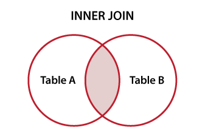
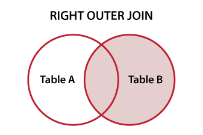
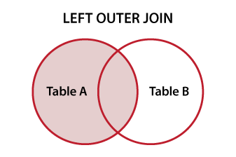

# Consultas Relacionales

<div id='index'></div>

* [Inner Joins](#inner-joins)
    * [Varios condicionales en un Inner Join](#varios-condicionales-en-un-inner-join)
    * [Unir varias tablas a la vez](#unir-varias-tablas-a-la-vez)
* [Inner vs Outer Joins](#inner-vs-outer-joins)
    * [RIGHT JOIN](#right-join)
    * [LEFT JOIN](#left-join)
* [Realizar un resumen del contenido de varias tablas](#realizar-un-resumen-del-contenido-de-varias-tablas)


<br/>

[<< CONTROL FLOW](./05_control_flow.md#control-flow) | [HOME](../../README.md#devcamp) | 

<br/>

<hr/><hr/><br/>

Hasta ahora, a lo largo del curso, hemos visto cómo hacer diversas operaciones con las tablas y las bases de datos en general. En esta sección, vamos a ver cuál es uno de los motivos principales por los cuales SQL es una herramienta tan solicitada: las **consultas relacionales**.

***- ¿Qué son las consultas relacionales?***

Como su nombre indica, una consulta relacional es aquella consulta que obtiene información (*realiza consultas*) a más de una tabla a la vez. Es decir, relacionar los datos de una tabla con los datos de otra y obtener esa información. ¡Vamos a ver cómo se consigue esto!

<br/>

<hr/><hr/><br/>

## Inner Joins

Como siempre, vamos a explicar cómo realizar estas consultas con ejemplos. En primer lugar, vamos a recordar qué parámetros (*columnas*) tenemos en las tablas `guides` y `users`:

* Tabla `guides`:
    * `guides_id`
    * `guides_revenue`
    * `guides_users_id`
    * `guides_title`
    * `guides_qty`

* Tabla `users`:
    * `users_id`
    * `users_name`
    * `users_email`

<br/>

Partiendo de estas dos tablas, vamos a hacer una consulta que devuelva información de ambas:

```sql
SELECT * FROM guides							# (1)
INNER JOIN users								# (2)
ON guides.guides_users_id = users.users_id;		# (3)
```

<br/>

* **(1):** indicamos qué es lo que queremos obtener.
* **(2):** indicamos con qué tabla debemos relacionar la tabla anteriormente indicada.
* **(3):** indicamos qué columna de la primera tabla está relacionada con qué columna de la segunda.

<br/>

El resultado obtenido es el siguiente:

| `guides_id` | `guides_revenue` | `guides_users_id` | `guides_title`          | `guides_qty` | `users_id` | `users_names` | `users_email`    |
| ----------- | ---------------- | ----------------- | ----------------------- | ------------ | ---------- | ------------- | ---------------- |
| 1           | 500              | 2                 | My Blog                 | 543          | 2          | Kristine      | update@test.com  |
| 2           | 1500             | 3                 | Something Else          | 685          | 3          | Tiffany       | tiffany@test.com |
| 3           | 750              | 3                 | My Great Post           | 0            | 3          | Tiffany       | tiffany@test.com |
| 4           | 1000             | 2                 | My Blog                 | 0            | 2          | Kristine      | update@test.com  |
| 5           | 750              | 3                 | My Blog                 | 0            | 3          | Tiffany       | tiffany@test.com |
| 6           | 5000             | 2                 | Another One of My Posts | 0            | 2          | Kristine      | update@test.com  |
| 7           | 500              | 2006              | Guide by Jon            | 0            | 2006       | Jon           | jon@snow.com     |

<br/>

Como se puede observar, se ha recibido como resultado toda la información de ambas tablas. Esto se debe a que hemos utilizado un `SELECT *` a la hora de realizar la consulta.

> Utilizar `INNER JOIN` es exactamente lo mismo que usar solamente `JOIN`, porque es el tipo de unión por defecto.
>
> A partir de ahora, haremos uso de `JOIN` al realizar este tipo de uniones para que sea ligeramente más corto el código.

<br/>

He aquí otro ejemplo, donde seleccionaremos las columnas que deseemos obtener, haremos uso de [aliases](./05_control_flow#alias-en-tablas), y funciones vistas en otros apartados:

```sql
SELECT
	g.guides_title,
	g.guides_revenue,
	u.users_name,
	u.users_email
FROM guides g
JOIN users u
ON g.guides_users_id = u.users_id
ORDER BY g.guides_revenue DESC;
```

<br/>

Con esto, lo que conseguimos es lo siguiente:

| `guides_title`          | `guides_revenue` | `users_name` | `users_email`    |
| ----------------------- | ---------------- | ------------ | ---------------- |
| Another One of My Posts | 5000             | Kristine     | update@test.com  |
| Something Else          | 1500             | Tiffany      | tiffany@test.com |
| My Blog                 | 1000             | Kristine     | update@test.com  |
| My Great Post           | 750              | Tiffany      | tiffany@test.com |
| My Blog                 | 750              | Tiffany      | tiffany@test.com |
| My Blog                 | 500              | Kristine     | update@test.com  |
| Guide by Jon            | 500              | Jon          | jon@snow.com     |

<br/>

Como se puede observar en la tabla, tenemos las 4 columnas que habíamos seleccionado, podemos ver qué usuario ha realizado cada guía (*al igual que en el ejemplo anterior*), y tenemos la consulta ordenada de forma descendiente según la columna `guides_revenue`.

> * **`INNER JOIN`: Sólo los registros que coinciden con la condición de combinación son retornados.**
>
> * Imagen representativa:
>
> 

<br/>

<hr/><br/>

### Varios condicionales en un Inner Join

Hemos visto cómo realizar consultas simples utilizando la unión `INNER JOIN` (*también llamada simplemente `JOIN`*). Vamos a ver otro ejemplo donde añadir varias condiciones:

```sql
# 1 condición basada en la tabla `users`
SELECT * FROM guides g
JOIN users u
ON g.guides_users_id = u.users_id
WHERE u.users_name = 'Tiffany';

# 1 condición basada en la tabla `guides`
SELECT * FROM guides g
JOIN users u
ON g.guides_users_id = u.users_id
WHERE g.guides_revenue > 700;

# Varias condiciones basadas en ambas tablas
SELECT * FROM guides g
JOIN users u
ON g.guides_users_id = u.users_id
WHERE g.guides_revenue > 750
AND u.users_name = 'Tiffany'
OR u.users_name = 'Kristine';
```

<br/>

<hr/><hr/><br/>

### Unir varias tablas a la vez

Tenemos 3 tablas en la base de datos. Hasta ahora, hemos visto cómo unir dos de ellas, pero vamos a ver cómo podemos unir las 3 (*o más, si las tuviéramos*), y qué características debemos tener en cuenta:

```sql
SELECT *
FROM users u
JOIN guides g
	ON g.guides_users_id = u.users_id
JOIN addresses a
	ON a.addresses_users_id = u.users_id
ORDER BY g.guides_revenue DESC;
```

<br/>

Esta consulta nos da como resultado **todas** las columnas de las 3 tablas, sin embargo, algunas de ellas aparecen duplicadas y no aparecen todos los usuarios.

***- ¿Por qué ocurre esto?***

Esto se debe a que solo se muestran los usuarios que tienen relación con las tablas `guides` y `addresses`. Es decir, aquellos usuarios que no tengan guías ni direcciones asignadas, no aparecerán en estas consultas.

Además, algunos usuarios tienen insertadas dos direcciones, por lo que sus datos de la tabla `users` y la tabla `guides` aparecen *duplicados* con motivo de enseñar toda la información de `addresses`.

<br/>

<hr/><hr/><br/>

## Inner vs Outer Joins

En el apartado anterior hablamos de los `INNER JOIN`s (*también llamado solo `JOIN`*), en esta sección vamos a ver las diferencias entre los `INNER` y los ***Outer*** Joins.

A modo de recordatorio,  si queremos realizar un `INNER JOIN` debemos hacer lo siguiente:

```sql
SELECT *
FROM guides g
JOIN users u
ON g.guides_users_id = u.users_id;
```

<br/>

Haciendo esto, obtenemos como resultado una tabla donde se muestran todos los `guides`  y solos los `users` que tienen un `guide` asociado. Es decir, **no se muestran todos los usuarios**, solo aquellos que tienen una guía escrita.

<br/>

<hr/><br/>

### RIGHT JOIN

Si quisiéramos generar algún informe donde se mostraran todos los usuarios, deberíamos hacer uso de los **Outer Joins**:

```sql
SELECT *
FROM guides g
RIGHT JOIN users u
ON g.guides_users_id = u.users_id;
```

<br/>

En este caso, se muestran los mismos datos que en el caso anterior, pero **añadiendo los usuarios que no tienen guías asociadas**, por lo que en las columnas pertenecientes a `guides`, aparece como dato `NULL`.

| `guides_id` | `guides_revenue` | `guides_users_id` | `guides_title`          | `guides_qty` | `users_id` | `users_name` | `users_email`    |
| ----------- | ---------------- | ----------------- | ----------------------- | ------------ | ---------- | ------------ | ---------------- |
| 6           | 5000             | 2                 | Another One of My Posts | 552          | 2          | Kristine     | update@test.com  |
| 4           | 1000             | 2                 | My Blog                 | 148          | 2          | Kristine     | update@test.com  |
| 1           | 500              | 2                 | My Blog                 | 148          | 2          | Kristine     | update@test.com  |
| 5           | 750              | 3                 | My Blog                 | 199          | 3          | Tiffany      | tiffany@test.com |
| 3           | 750              | 3                 | My Great Post           | 847          | 3          | Tiffany      | tiffany@test.com |
| 2           | 1500             | 3                 | Something Else          | 685          | 3          | Tiffany      | tiffany@test.com |
| `NULL`      | `NULL`           | `NULL`            | `NULL`                  | `NULL`       | 6          | Demo 0       | test0@test.com   |
| `NULL`      | `NULL`           | `NULL`            | `NULL`                  | `NULL`       | 7          | Demo 1       | test1@test.com   |
| ...         | ...              | ...               | ...                     | ...          | ...        | ...          | test0@test.com   |

> * **`RIGHT JOIN`: retorna todas las filas de la tabla derecha aunque no haya coincidencias en la tabla izquierda.**
> * Imagen representativa:
>
> 

<br/>

<hr/><br/>

### LEFT JOIN

Este método tiene otro muy similar a él, llamado `LEFT JOIN`. Veamos qué es lo que ocurre con él:

```sql
SELECT *
FROM guides g
LEFT JOIN users u
ON g.guides_users_id = u.users_id;
```

<br/>

Haciendo esto, se obtiene **el mismo resultado que realizando un `INNER JOIN`**.

*** - ¿Y si cambiamos el orden de las tablas?***

```sql
SELECT *
FROM users u
LEFT JOIN guides g
ON g.guides_users_id = u.users_id;
```

<br/>

Ahora se obtiene el **mismo resultado que con `RIGHT JOIN`, pero cambiando el orden de las columnas**, mostrando primero las columnas pertenecientes a la tabla `users`, seguidas de aquellas pertenecientes a la tabla `guides`.

*** - ¿Por qué?***

* En los ***Outer Joins*** importa el orden de las tablas. Tenemos dos opciones:
    * Mantener siempre el mismo orden de las tablas y simplemente cambiar un `RIGHT JOIN` por un `LEFT JOIN`.
    * Cambiar el orden en el que se *unen* las tablas.

> * **`LEFT JOIN`: retorna todas las filas de la tabla izquierda aunque no haya coincidencias en la tabla derecha.**
> * Imagen representativa:
>
> 
>
> El conjunto resultante contiene todas las filas de la tabla izquierda y los datos que coincidan de la tabla derecha. Si no se encuentra ninguna coincidencia para una fila particular, `NULL` es retornado.

<br/>

Por todo eso, al hacer:

```sql
SELECT *
FROM guides g
LEFT JOIN users u
ON g.guides_users_id = u.users_id;
```

<br/>

Obtenemos lo mismo que un `INNER JOIN`, porque en nuestro ejemplo todos los registros de la tabla izquierda (`guides`) tienen un usuario asignado.

<br/>

<hr/><hr/><br/>

## Realizar un resumen del contenido de varias tablas

Si ejecutamos el siguiente código:

```sql
SELECT *
FROM users u
JOIN addresses a
	ON a.addresses_users_id = u.users_id
JOIN guides g
	ON g.guides_users_id = u.users_id;
```

<br/>

Veremos que en el resultado obtenido se muestran únicamente dos usuarios con varias entradas (*puesto que tienen varias guías cada uno*), y se repiten las direcciones de la tabla `addresses`. Esto se debe a que el resto de usuarios no tiene ningún dato asociado a ambas tablas (*`addresses` o `guides`*), puede que tengan registros en una u otra, pero no en ambas.

> Los únicos usuarios que se van a mostrar aquí (*puesto que se trata de un `INNER JOIN`, son aquellos que tengan datos asociados en todas las tablas que se vayan a unir*).

<br/>

Vamos a tratar de resolver eso con el siguiente objetivo:

* Mostrar cada usuario.
* Mostrar cuántas guías ha escrito cada uno.
* Mostrar cuántas direcciones hay registradas para cada usuario.

<br/>

Este es el código que vamos a utilizar:

```sql
SELECT 						# (1) -- Qué queremos seleccionar
	u.users_email AS 'Email',
    COALESCE(g.guide_count, 0) AS guide_count,
	COALESCE(a.address_count, 0) AS address_count
FROM users u				# (2) -- Cuál es la tabla principal
LEFT JOIN (					# (3) -- Unión de tablas
	SELECT COUNT(*) AS guide_count, guides_users_id
    FROM guides
    GROUP BY guides_users_id
) AS g
	ON g.guides_users_id = u.users_id
LEFT JOIN (					# (4) -- Unión de tablas
	SELECT COUNT(*) AS address_count, addresses_users_id
    FROM addresses
    GROUP BY addresses_users_id
) AS a
	ON a.addresses_users_id = u.users_id
ORDER BY u.users_email;		# (5) -- Ordenamos el resultado
```

<br/>

Lo que se hace es lo siguiente:

1. Seleccionamos el email de los usuarios y le ponemos el alias `'Email'`. Utilizamos `COALESCE()` para contar la cantidad de guías y direcciones sin tener en cuenta valores de tipo `NULL`, a los cuales se les dará un valor de `0`.

    > La función `COALESCE()` se utiliza para manejar valores nulos, donde dichos valores se reemplazan por el valor definido en el segundo parámetro de la función.

2. Indicamos que la tabla *principal* va a ser la tabla `users`, a la cual le damos el alias `u`.
3. Realizamos una *Outer Join* del resultado de la subconsulta, donde contamos la cantidad de guías que tiene cada usuario. Como en `(1)` hemos usado la función `COALESCE()`, aquellos valores nulos se mostrarán con un valor de `0`.
4. Realizamos una *Outer Join* del resultado de la subconsulta, donde contamos la cantidad de direcciones que tiene cada usuario. Como en `(1)` hemos usado la función `COALESCE()`, aquellos valores nulos se mostrarán con un valor de `0`.
5. Indicamos que queremos que se ordene todo en función del email del usuario.