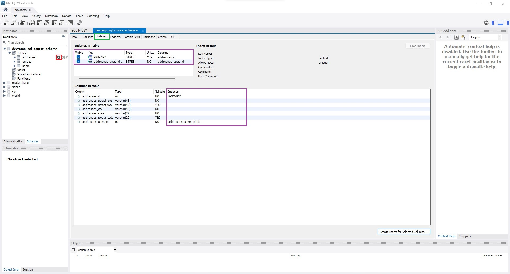
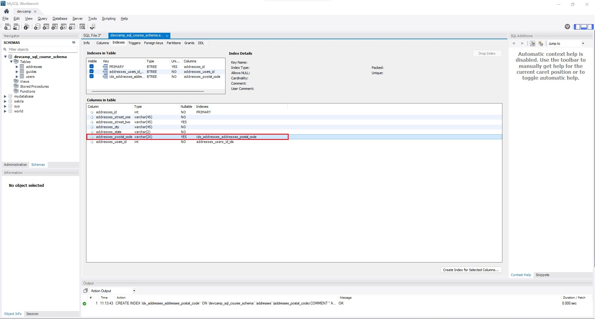

# Conceptos Avanzados

* [Índices](#índices)
    * [Ver los índices de una tabla](#ver-los-índices-de-una-tabla)
    * [Crear un nuevo índice](#crear-un-nuevo-índice)

 

[<< CONSULTAS RELACIONALES](./06_relational_queries.md#consultas-relacionales) | [HOME](../../README.md#devcamp)

 

## Índices

Los índices son una herramienta que facilitan mucho la búsqueda de ciertas consultas. Hacen que estas consultas sean más rápidas y eficaces.

Por ejemplo, si se quiere encontrar un ítem concreto entre 5 millones de ítems sin usar índices, SQL irá ítem a ítem hasta encontrar el que se le ha indicado. Si se usaran índices, sabiendo que el ítem que se está buscando se encuentra en el índice `317` (*por ejemplo*), podemos acceder a él directamente, ahorrando mucho tiempo.

 

 

### Ver los índices de una tabla

Sin darnos cuenta, MySQL ya ha creado varios índices a lo largo del curso. Para poder ver qué índices tenemos haremos lo siguiente:

1. **(Rojo):** Clicaremos en el botón de *información* de cualquiera de las tablas de nuestra base de datos, donde se abrirá un panel mostrando información de la misma.
2. **(Verde):** Seleccionaremos la pestaña de índices.
3. **(Morado):** Podremos ver qué índices tenemos creados ya en esa tabla.

 

 

### Crear un nuevo índice

Para crear más índices, desde el mismo panel mostrado [en el apartado anterior](#ver-los-índices-de-una-tabla), vamos a seguir estos pasos:

1. **(Rojo):** Seleccionamos la columna en la cual queremos crear un índice.
2. **(Verde):** Clicamos el botón inferior derecho que dice `Create Index for Selected Columns...`.
3. **(Morado):** Se habrá abierto una ventana, donde podemos modificar una serie de características. Por ahora, dejamos los valores por defecto y clicamos en `Create`.

 

Veremos que se ha creado el nuevo índice:

