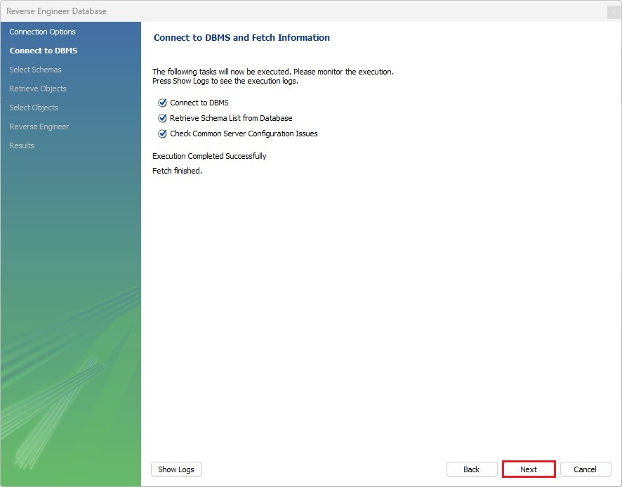
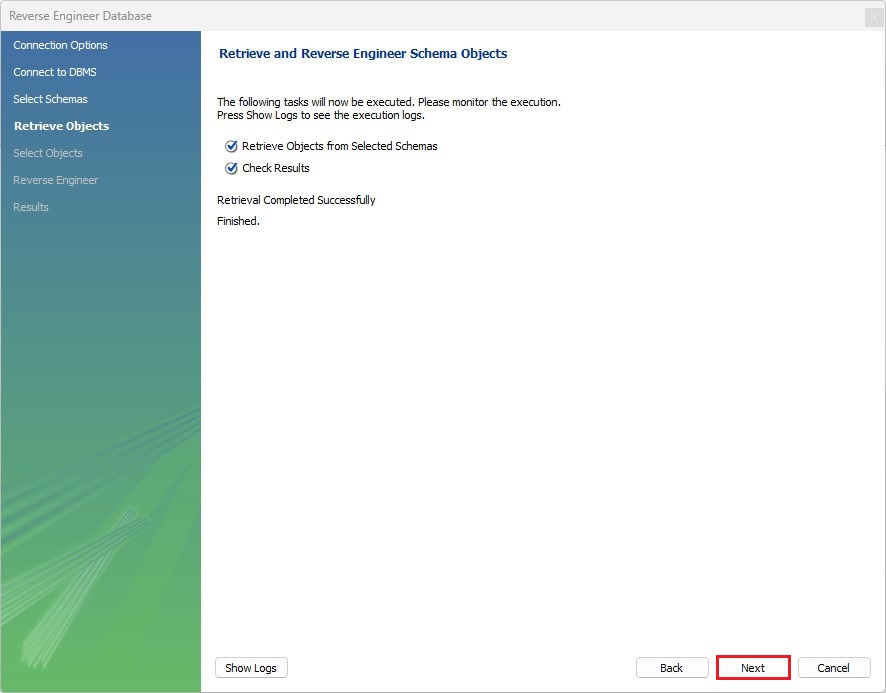
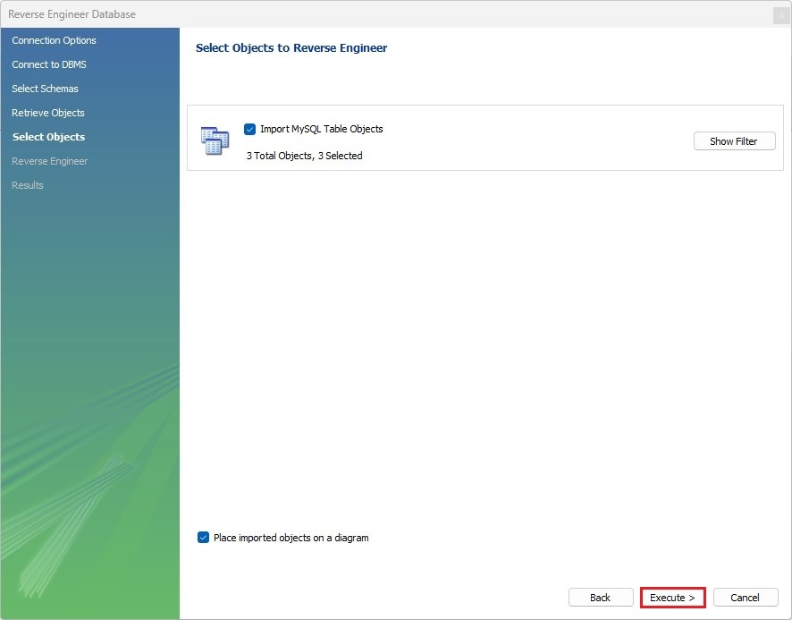
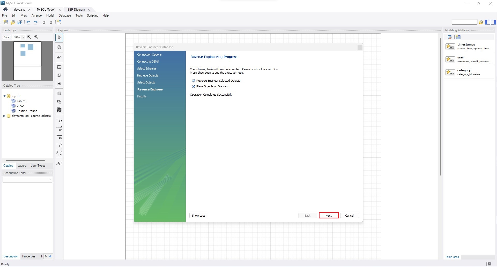

# Conceptos Avanzados

* [Índices](#índices)
    * [Ver los índices de una tabla](#ver-los-índices-de-una-tabla)
    * [Crear un nuevo índice](#crear-un-nuevo-índice)

* [Técnicas de normalización de bases de datos](#técnicas-de-normalización-de-bases-de-datos)
* [Modelizado de diagramas](#modelizado-de-diagramas)
    * [Crear un diagrama EER](#crear-un-diagrama-eer)
    * [Diagrama creado](#diagrama-creado)

 

[<< CONSULTAS RELACIONALES](./06_relational_queries.md#consultas-relacionales) | [HOME](../../README.md#devcamp) | [PROYECTO >>](./08_project#proyecto)

 

<a href='#index'>Volver arriba</a>

## Índices

Los índices son una herramienta que facilitan mucho la búsqueda de ciertas consultas. Hacen que estas consultas sean más rápidas y eficaces.

Por ejemplo, si se quiere encontrar un ítem concreto entre 5 millones de ítems sin usar índices, SQL irá ítem a ítem hasta encontrar el que se le ha indicado. Si se usaran índices, sabiendo que el ítem que se está buscando se encuentra en el índice `317` (*por ejemplo*), podemos acceder a él directamente, ahorrando mucho tiempo.

 

 

### Ver los índices de una tabla

Sin darnos cuenta, MySQL ya ha creado varios índices a lo largo del curso. Para poder ver qué índices tenemos haremos lo siguiente:

1. **(Rojo):** Clicaremos en el botón de *información* de cualquiera de las tablas de nuestra base de datos, donde se abrirá un panel mostrando información de la misma.
2. **(Verde):** Seleccionaremos la pestaña de índices.
3. **(Morado):** Podremos ver qué índices tenemos creados ya en esa tabla.

 

 

### Crear un nuevo índice

Para crear más índices, desde el mismo panel mostrado [en el apartado anterior](#ver-los-índices-de-una-tabla), vamos a seguir estos pasos:

1. **(Rojo):** Seleccionamos la columna en la cual queremos crear un índice.
2. **(Verde):** Clicamos el botón inferior derecho que dice `Create Index for Selected Columns...`.
3. **(Morado):** Se habrá abierto una ventana, donde podemos modificar una serie de características. Por ahora, dejamos los valores por defecto y clicamos en `Create`.

 

Veremos que se ha creado el nuevo índice:

 

 

<a href='#index'>Volver arriba</a>

## Técnicas de normalización de bases de datos

La normalización de bases de datos es esencialmente un conjunto de buenas prácticas y guías que nos permite construir y modelar una base de datos eficazmente.

He aquí una pequeña lista de buenas prácticas a seguir a la hora de crear una base de datos:

* **Cada tabla debe tener un único roll.** Es decir, es buena práctica tener una tabla `users` y otra `addresses`, y después relacionar ambas, pero no una tabla `x` donde se registren tanto usuarios como direcciones del mismo.
* **Utilizar el tipo de dato correcto para cada columna.** Puede resultar más fácil guardar *strings*, pero en ocasiones deberían utilizarse otro tipo de datos. Hay que ser inteligente y utilizar el tipo de dato que mejor se ajusta a las necesidades de cada variable.
* **Definir correctamente las características de cada columna.** Existen datos que deberían ser únicos (por ejemplo). Debemos asegurarnos de dar esa característica a ese tipo de columnas.
* **Utilizar siempre el mismo formato a la hora de nombrar las columnas.** No usar en algunas ***camelCase*** y en otras ***snake_case***, etc.

 

 

<a href='#index'>Volver arriba</a>

## Modelizado de diagramas

Haciendo uso del MySQL Workbench se puede ver de forma visual la relación entre las diferentes tablas de la base de datos.

 

 

### Crear un diagrama EER

Crearemos diagramas EER siguiendo estos pasos:

> 1. Pulsamos `ctrl + R` para abrir el panel.
> 2. Seleccionamos la base de datos cuyo diagrama queremos.
> 3. Pulsamos `Next`.

 

> Esperamos a que termine el proceso y clicamos en `Next`.

 

> Seleccionamos la base de datos y clicamos en `Next`.

 

> Esperamos a que termine el proceso y clicamos en `Next`.

 

> Clicamos en `Execute >` y esperamos.

 

> Se cambiará la pantalla de fondo. Cuando termine el proceso, clicamos en `Next`.

 

> Para terminar, clicamos en `Finish`.

 

 

### Diagrama creado

Después de seguir todos estos pasos, veremos lo siguiente:

 

Ahora tenemos una visualización de nuestras tablas de la base de datos. Podemos consultar de forma visual y rápida muchos aspectos y características de estas tablas:

* Podemos ver cómo están relacionadas entre sí con tan solo pasar el ratón sobre las *líneas* que las unen:

* Podemos ver cuáles son sus índices abriendo el selector `Indexes` que tienen en la parte de abajo:

* Podemos gestionar y manejar todos los aspectos de la base de datos desde aquí. Sin embargo, en este curso se opta por hacerlo mediante comandos, por lo que no se verá cómo hacerlo, simplemente, comentar que existe la opción.

 

 

[<< CONSULTAS RELACIONALES](./06_relational_queries.md#consultas-relacionales) | [HOME](../../README.md#devcamp) | [PROYECTO >>](./08_project#proyecto)